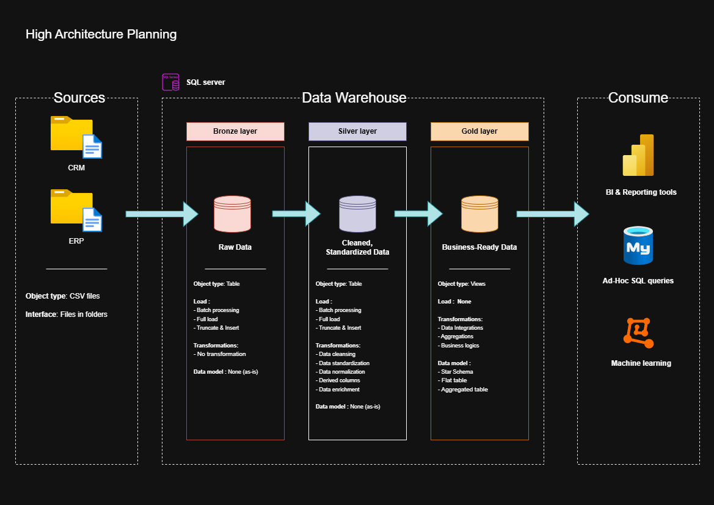

# Data Warehouse and Analytics Project

Welcome to the Data Warehouse and Analytics Project repository! 🚀
This project builds a modern data warehouse with SQL Server, including ETL processes, data modeling, and analytics to generating actionable insights. Designed as a portfolio project, it highlights industry best practices in data engineering and analytics.

This project follows the guided project of 'Data with Baraa' on Youtube : [SQL Data Warehouse from Scratch | Full Hands-On Data Engineering Project](https://www.youtube.com/watch?v=9GVqKuTVANE).

---

## 🏗️ Data Architecture

The data architecture for this project follows **Medallion Architecture** (**Bronze**, **Silver**, and **Gold** layers):



1. **Bronze Layer** : Stores raw data as-is from the source systems. Data is ingested from CSV Files into SQL Server Database.
2. **Silver Layer** : This layer includes data cleansing, standardization, and normalization processes to prepare data for analysis.
3. **Gold Layer** : Houses business-ready data modeled into a star schema required for reporting and analytics.

---

## 📖 Project Overview

This project involves:

1. **Data Architecture** : Designing a Modern Data Warehouse Using Medallion Architecture  **Bronze** ,  **Silver** , and **Gold** layers.
2. **ETL Pipelines** : Extracting, transforming, and loading data from source systems into the warehouse.
3. **Data Modeling** : Developing fact and dimension tables optimized for analytical queries.
4. **Analytics & Reporting** : Creating SQL-based reports and dashboards for actionable insights.

🎯 This repository is an excellent resource for professionals and students looking to showcase expertise in:

* SQL Development
* Data Architect
* Data Engineering
* ETL Pipeline Developer
* Data Modeling
* Data Analytics

---

## 🛠️ Tools:

(Copy pasted from sir Salkini's repository)

* **[Datasets](https://github.com/DataWithBaraa/sql-data-warehouse-project/blob/main/datasets):** Access to the project dataset (csv files).
* **[SQL Server Express](https://www.microsoft.com/en-us/sql-server/sql-server-downloads):** Lightweight server for hosting your SQL database.
* **[SQL Server Management Studio (SSMS)](https://learn.microsoft.com/en-us/sql/ssms/download-sql-server-management-studio-ssms?view=sql-server-ver16):** GUI for managing and interacting with databases.
* **[Git Repository](https://github.com/):** Set up a GitHub account and repository to manage, version, and collaborate on your code efficiently.
* **[DrawIO](https://www.drawio.com/):** Design data architecture, models, flows, and diagrams.
* **[Notion](https://www.notion.com/templates/sql-data-warehouse-project):** Get the Project Template from Notion
* **[Notion Project Steps](https://thankful-pangolin-2ca.notion.site/SQL-Data-Warehouse-Project-16ed041640ef80489667cfe2f380b269?pvs=4):** Access to All Project Phases and Tasks.

---

## 📂 Repository Structure

```
sql_data_warehouse_project_with_baraa/
│
├── _diagram_files/                     # Draw.io files used to create diagram
│
├── _img/                           	# Contains all the images files (.png) used in this project
│
├── datasets/                           # Raw datasets used for the project (ERP and CRM data)
│
├── docs/                               # Project documentation and architecture details
│   ├── step_by_step_process/           # Contains each step of this guided project with markdown files
│   ├── data_catalog.md                 # Catalog of datasets, including field descriptions and metadata
│   └── naming-conventions.md           # Consistent naming guidelines for tables, columns, and files
│
├── scripts/                            # SQL scripts for ETL and transformations
│   ├── bronze/                         # Scripts for extracting and loading raw data
│   ├── silver/                         # Scripts for cleaning and transforming data
│   └── gold/                           # Scripts for creating analytical models
│
├── tests/                              # Test scripts and quality files
│
├── .gitignore                          # Files and directories to be ignored by Git
├── LICENSE                             # License information for the repository
└── README.md                           # Project overview and instructions
```

---

## 🛡️ License

This project is licensed under the [MIT License](LICENSE). You are free to use, modify, and share this project with proper attribution.

---

## 🤝 About Me

Hello there. #insert-kenobi-meme-gif

I'm Matthew, a Data Analyst student transitioning toward a Data Engineering position, with Analytics Engineer as my long-term goal. I bring 11 years of professional experience, including 8 years in digital marketing, with strategic and operational expertise across diverse industries (tires, merchant marine, Virtual Reality accessories, and e-commerce) and targets (B2C, B2B2C, B2B, retail, army and defense forces).

This extensive background has given me a solid understanding of marketing challenges, product strategy, and ROI optimization. Currently pursuing training in Data Analysis and Data Engineering, I'm drawn to these fields for their strong business focus and natural synergy with my marketing expertise.

I'm eager to leverage my skills in data structuring, analysis, and value creation to contribute to your projects as a Data Engineer through a work-study contract (contrat de professionnalisation) starting in March 2026.

*Ô rage ! ô désespoir ! ô dataset ennemi !
N'ai-je donc tant vécu que pour ne pas avoir ce KPI
Et ne suis-je blanchi dans tous ces rapports clairs
Que pour voir en un jour flétrir tant d'OKRs ?*

[](https://www.linkedin.com/in/matthew-rives/)

---

## 🌟 About Baraa, creator of the initial project

(Copy pasted from sir Salkini's repository)

Hi there! I'm **Baraa Khatib Salkini**, also known as **Data With Baraa**. I’m an IT professional and passionate YouTuber on a mission to share knowledge and make working with data enjoyable and engaging!

Let's stay in touch! Feel free to connect with me on the following platforms:

[](http://bit.ly/3GiCVUE)
[](https://linkedin.com/in/baraa-khatib-salkini)
[](https://www.datawithbaraa.com)
[](https://bit.ly/BaraaNewsletter)
[](https://paypal.me/baraasalkini)
[](https://www.youtube.com/@datawithbaraa)
