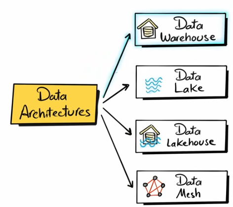

# Data Management Approach

Data Warehouse  
Data Lake  
Data Lakehouse  
Data Mesh  

Data Warehouse : 

Stage : Where all data is landing
EDW : Enterprise Data Warehouse, model the data using the third normal format (3NF)
Data Marts : design subset of EDW in a way to be consumed from reporting, one topic per subset only