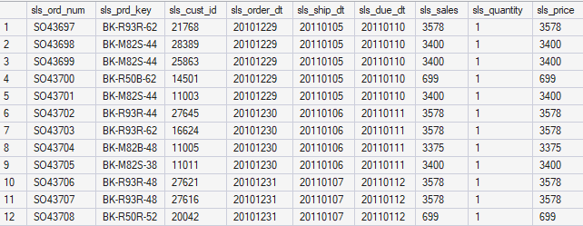
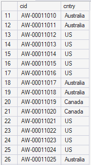

# Exploring and understanding data
Explore data manually to understand what means each columns and the potential relationship between each.
in sql server management, DB > Tables > right click on the desired table > select top 1000 rows

## crm cust info

## crm prd info

## crm sales details

sls_cust_id : FK crm cust info
sls_prd_key : FK crm prd info
quantity and price : event table -> transactional

## erp cust az12

cid seems to be connected to the cst_key from crm cust info. 

## erp loc a101

## erp px cat g1v2 

partial match between id from erp px cat g1v2 and prd_key in crm prd info 

