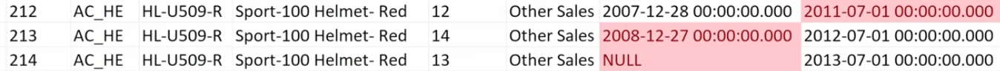
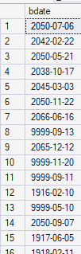

# Check bronze tables and prepare cleaning operations
Detect quality issues with the data
and then we will write the transformation scripts 

Several kinds of operations: 
- Removing unwanted spaces : for data consistency
- Data normalization and standardization : mapping values to meaningful, user-friendly descriptions
- Handling missing values : filling the blanks with a default value
- Remove duplicates : ensure only one record per entity by identifying and retaining the most relevant row

## For crm_cust_info
### 1. Duplicated keys
Primary key must be unique and not null
#### Check

```
SELECT 
	cst_id,
	COUNT(*)
FROM bronze.crm_cust_info
GROUP BY cst_id
HAVING COUNT(*) > 1 OR cst_id IS NULL;
```


For something more complete:

```
SELECT 
    CASE 
        WHEN cst_id IS NULL THEN 'NULL'
        ELSE CAST(cst_id AS VARCHAR)
    END as cst_id,
    COUNT(*) as nb_occurrences,
    CASE 
        WHEN cst_id IS NULL THEN 'Valeur nulle'
        ELSE 'Doublon'
    END as type_anomalie
FROM bronze.crm_cust_info
GROUP BY cst_id
HAVING COUNT(*) > 1 OR cst_id IS NULL
ORDER BY nb_occurrences DESC;
```


#### Investigate duplicates

Take one of the duplicated id
Find what is wrong and how we could correct it
The best is to have timestamp to help us. 
For 29466, the most recent record is the one to keep because it has the most fresh information. 


#### Cleaning
We have to rank them based on cst create date. 
And select the most recent one.

```
SELECT *
FROM (
	SELECT 
		*,
		ROW_NUMBER() OVER (PARTITION BY cst_id ORDER BY cst_create_date DESC) AS flag_last
	FROM bronze.crm_cust_info
	WHERE cst_id IS NOT NULL
) AS t 
WHERE flag_last = 1
```


### 2. Unwanted spaces in string values
#### Check

```
SELECT cst_firstname
FROM bronze.crm_cust_info
WHERE cst_firstname != TRIM(cst_firstname)
```


#### Clean

Trim the columns with unwanted 
```
SELECT
	(other columns)
	TRIM(cst_firstname) AS cst_firstname, 
	TRIM(cst_lastname) AS cst_lastname
	(other columns)
FROM bronze.crm_cust_info
```


### 3. Consistency of low cardinality columns
Columns with a limited number of possible values


#### For gender 
##### Check
```
SELECT DISTINCT cst_gndr
FROM bronze.crm_cust_info
```

Results: NULL, F, M

##### Clean
In the datawarehouse, we aim to store clear and meaninful values rather than using abbreviated terms. Just in case of mixed-cased values that could appear later, we use UPPER(). Same with the trim.
For missing values, we will use the default value 'n/a'

```
SELECT
	(other columns)
	CASE 
		WHEN UPPER(TRIM(cst_gndr)) = 'F' THEN 'Female'
		WHEN UPPER(TRIM(cst_gndr)) = 'M' THEN 'Male'
		ELSE 'n/a'
	END
	(other columns)
FROM bronze.crm_cust_info
```


#### For marital status 
We do exactly the same thing. 

```
SELECT
	(other columns)
	CASE 
		WHEN UPPER(TRIM(cst_marital_status)) = 'M' THEN 'Married'
		WHEN UPPER(TRIM(cst_marital_status)) = 'S' THEN 'Single'
		ELSE 'n/a'
	END
	(other columns)
FROM bronze.crm_cust_info
```


#### Results


## Date

No proble detected


---

## For crm_prd_info
Same as before. 

### 1. Duplicated keys

```
SELECT
	prd_id,
	COUNT(*)
FROM
	bronze.crm_prd_info
GROUP BY 
	prd_id
HAVING
	COUNT(*) > 1 OR prd_id IS NULL
```

Results : no problem

### 2. Match keys in other table

#### Category id
##### Investigate
In the bronze.erp_px_cat_g1v2, we saw the column 'id' with values like 'CO_BR'

It matches the first characters of prd_key in crm prd info


##### Clean 
```
SELECT
	(other columns)
	prd_key,
	REPLACE(SUBSTRING(prd_key, 1, 5), '-', '_') AS cat_id,
	(other columns)
FROM
	bronze.crm_prd_info
```

##### Check

```
SELECT
	prd_id,
	prd_key,
	REPLACE(SUBSTRING(prd_key, 1, 5), '-', '_') AS cat_id,
	prd_nm,
	prd_cost,
	prd_line,
	prd_start_dt,
	prd_end_dt
FROM
	bronze.crm_prd_info
WHERE 
	REPLACE(SUBSTRING(prd_key, 1, 5), '-', '_') NOT IN (SELECT DISTINCT id FROM bronze.erp_px_cat_g1v2)
```

These keys are in crm prd info but not in erp px cat g1v2


#### Product key
##### Investigate
In erp sales details, col sls prd key


##### Clean

```
SELECT
	(other columns)
	prd_key,
	REPLACE(SUBSTRING(prd_key, 1, 5), '-', '_') AS cat_id,
	SUBSTRING(prd_key, 7, LEN(prd_key)) AS prd_key
	(other columns)
FROM
	bronze.crm_prd_info
```


##### Check

```
SELECT
	(other columns)
	prd_key,
	REPLACE(SUBSTRING(prd_key, 1, 5), '-', '_') AS cat_id,
	SUBSTRING(prd_key, 7, LEN(prd_key)) AS prd_key
	(other columns)
FROM
	bronze.crm_prd_info
WHERE
	SUBSTRING(prd_key, 7, LEN(prd_key)) NOT IN (SELECT sls_prd_key FROM bronze.crm_sales_details)
```


### 3. Unwanted spaces in string values
#### Check

```
SELECT
	prrd_nm
FROM
	bronze.crm_prd_info
WHERE
	prd_nm != TRIM(prd_nm)
```

No problem detected

### 4. Missing values

#### Check

```
SELECT
	prd_cost
FROM
	bronze.crm_prd_info
WHERE
	prd_cost < 0 OR prd_cost IS NULL
```

#### Clean
Must clean it to avoid any problem with aggregating functions 

```
SELECT
	(other columns)
	ISNULL(prd_cost, 0) AS prd_cost
	(other columns)
FROM
	bronze.crm_prd_info
```

### 5. Consistency of low cardinality columns

prd_line contains abbreviations and null values

```
SELECT
	(other columns)
	CASE 
		WHEN UPPER(TRIM(prd_line)) = 'M' THEN 'Mountain'
		WHEN UPPER(TRIM(prd_line)) = 'R' THEN 'Road'
		WHEN UPPER(TRIM(prd_line)) = 'S' THEN 'Other Sales'
		WHEN UPPER(TRIM(prd_line)) = 'T' THEN 'Touring'
		ELSE 'n/a'
	END AS prd_line
FROM
	bronze.crm_prd_info
```

Cleanier code: 

```
SELECT
	(other columns)
	CASE UPPER(TRIM(prd_line))
		WHEN 'M' THEN 'Mountain'
		WHEN 'R' THEN 'Road'
		WHEN 'S' THEN 'Other Sales'
		WHEN 'T' THEN 'Touring'
		ELSE 'n/a'
	END AS prd_line
FROM
	bronze.crm_prd_info
```

### 6. Date

#### Check
End date must not be earlier than the start date

```
SELECT *
FROM bronze.crm_prd_info
WHERE prd_end_dt < prd_start_dt
```


#### Clean
Extract the problematic data to Excel and try different approaches to solve the problems.


##### Solution 1 : Swap end date and start date
For prd_id, 212 to 214 included. Despite a different prd_id, the product is the same (same cat id, same prd key). Only the price changes, as well as the dates of this product-price combination. 

**Problem 1 : the date are overlapping.** 
From 2008 to 2011, we can't have the same product with both 12 and 14 for price cost. 

The end of the first history should be older than the start of the next records. 

**Problem 2 : we must always have a starting date.**
In the original extract, we can have no ending date



##### Solution 2 : 
End date = start date of the next record -1


Must be confirmed with the source expert.

#### Transform

```
SELECT
	(other cols)
	prd_start_dt, 
	LEAD(prd_start_dt) OVER (PARTITION BY prd_key ORDER BY prd_start_dt)-1 AS prd_end_dt
	(other cols)
FROM 
	bronze.crm_prd_info 
```

#### Check

```
SELECT
	prd_id,
	prd_key,
	REPLACE(SUBSTRING(prd_key, 1, 5), '-', '_') AS cat_id,
	prd_nm,
	prd_cost,
	prd_line,
	prd_start_dt, 
	prd_end_dt,
	LEAD(prd_start_dt) OVER (PARTITION BY prd_key ORDER BY prd_start_dt)-1 AS prd_end_dt_test
FROM 
	bronze.crm_prd_info 
WHERE prd_end_dt < prd_start_dt
ORDER BY prd_key, cat_id, prd_id
```


#### Cast
Since the dates values have no time info (only 00:00:00:000 at the end), we can cast them to simple date.

```
SELECT
	(other cols)
	CAST (prd_start_dt AS DATE) AS prd_start_dt, 
	CAST (LEAD(prd_start_dt) OVER (PARTITION BY prd_key ORDER BY prd_start_dt)-1 AS DATE) AS prd_end_dt
	(other cols)
FROM 
	bronze.crm_prd_info 
```


---
## For crm_sales_details


### Repeat the previous steps
#### Check for duplicates
#### Trim Data
#### Handling missing values

### Date format 
#### Check
The data are an integer (20201229). 
Check if date (int) <= 0. Results : No negative value, a lot of 0. 
0 values must be replaced by null. 
For non-null value, check of they all have 8 characters 
Check for outliers by validating the boundaries of the data range

```
SELECT 
	NULLIF(sls_order_dt,0) sls_order_dt
FROM
	bronze.crm_sales_details
WHERE
	sls_order_dt <= 0 
	OR LEN(sls_order_dt) != 8 
	OR sls_order_dt > 20500101
	OR sls_order_dt < 19000101
```
#### Clean

```
SELECT 
	(other cols)
	CASE 
		WHEN sls_order_dt = 0 OR LEN(sls_order_dt) != 8 THEN NULL
		ELSE CAST(CAST(sls_order_dt AS VARCHAR) AS DATE)
	END AS sls_order_dt,
	(other cols)
FROM
	bronze.crm_sales_details
WHERE
	sls_order_dt <= 0 
	OR LEN(sls_order_dt) != 8 
	OR sls_order_dt > 20500101
	OR sls_order_dt < 19000101
```

#### Repeat for all dates
Even if the other date columns don't have these problem, the clean query should be applied to them too. In case of a change in the source files in the future. 

### Date order
Order Date must always be earlier than the Shipping Date or Due Date

#### Check
```
SELECT *
FROM bronze.crm_sales_details
WHERE sls_order_dt > sls_ship_dt OR sls_order_dt > sls_due_dt 
```

No problem found

### Business rules
Sum of sales = Quantity * Price
Negative, Zeros, Nulls are not allowed

#### Check

```
SELECT
	sls_sales,
	sls_quantity,
	sls_price
FROM
	bronze.crm_sales_details
WHERE
	sls_sales != sls_quantity * sls_price 
	OR sls_sales IS NULL OR sls_quantity IS NULL OR sls_price IS NULL
	OR sls_sales <= 0 OR sls_quantity <= 0 OR sls_price <= 0
ORDER BY sls_sales, sls_quantity, sls_price
```

#### Clean
Talk to a source expert about the problem
If possible, try to solve it at the source
If impossible to fixe it at the source, clean it. The expert must accompany us to fix these issues with rules. 

Rules 1 : 
If sales negative, zero or null, derive it using Quantity and Price

Rules 2 : 
If price is zero or null, calculate it using Sales and Quantity 

Rules 3 : 
If price is negative, convert it to a positive value

```
SELECT DISTINCT
	sls_sales AS old_sls_sales,
	sls_quantity,
	sls_price AS old_sls_price,
	CASE
		WHEN sls_sales IS NULL OR sls_sales <= 0 OR sls_sales != sls_quantity * ABS(sls_price)
		THEN sls_quantity * ABS(sls_price)
		ELSE sls_sales
	END AS sls_sales,
		
	CASE
		WHEN sls_price IS NULL OR sls_price <= 0 
		THEN sls_sales / NULLIF(sls_quantity, 0)
		ELSE sls_price
	END AS sls_price
FROM bronze.crm_sales_details
```


---
## ERP cust az12 

### Customer key


Extra characters in the customer key
For the check, the insert must have been done with silver.cust_info

```
SELECT 
	cid,
	CASE WHEN cid LIKE 'NAS%' THEN SUBSTRING(cid, 4, LEN(cid))
		ELSE cid
	END AS cid
FROM bronze.erp_cust_az12
WHERE
	CASE WHEN cid LIKE 'NAS%' THEN SUBSTRING(cid, 4, LEN(cid))
	ELSE cid
	END NOT IN (SELECT DISTINCT cst_key FROM silver.cust_info)
```

If returns 0, everything is good
### Date 
#### Check

Check for outliers (older than 100 years old ? born in the future ?)

```
SELECT 
	bday
FROM bronze.erp_cust_az12
WHERE bdate < '1924-01-01' OR bdate > GETDATE()
```




#### Clean
Talk to a source expert
By default, remove extreme values

```
CASE 
	WHEN bdate > GETDATE() THEN NULL
	ELSE bdate
END AS bdate  
```

### Gender
#### Check
```
SELECT DISTINCT gen
FROM bronze.erp_cust_az12
```

Results : NULL, F, (nothing), Male, Female, M

#### Clean
```
CASE 
	WHEN UPPER(TRIM(gen)) IN ('F', 'FEMALE') THEN 'Female'
	WHEN UPPER(TRIM(gen)) IN ('M', 'MALE') THEN 'Male'
	ELSE 'n/a'
END AS gen
```

--- 

## erp loc a101

### Customer key
Same as before, must match the key in silver.crm_cust_info
Check
Clean 

```
SELECT
	REPLACE(cid, '-', '') cid
FROM 
	bronze.erp_loc_a101
WHERE
	REPLACE(cid, '-', '') cid NOT IN (SELECT cst_key FROM silver.crm_cust_info)
```

If nothing, it's good

## Countries

```
SELECT
	DISTINCT contry
FROM 
	bronze.erp_loc_a101
```


```
CASE
	WHEN TRIM(cntry) = 'DE' THEN 'Germany'
	WHEN TRIM(cntry) IN ('US', 'USA') THEN 'United States'
	WHEN TRIM(cntry) = '' OR cntry IS NULL THEN 'n/a'
	ELSE TRIM(cntry)
END AS cntry
```

---

## erp_px_cat_g1v2 
### Id 
In crm prd info, we created a prd id matching this id
Nothing to do

### Check for unwanted spaces

Check for all cols. 
Nothing wrong.


### Data standardization 

For cat
For subcat 
For maintenance 

Everything seems good and already normalized
