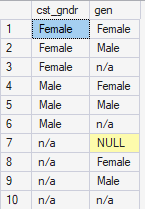
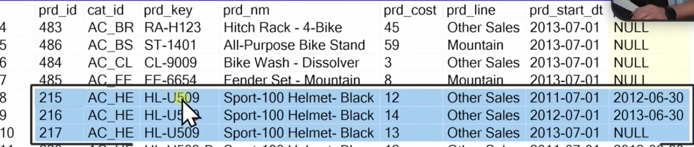

# Creating the Gold views
## Dimension Customers
### Join silver tables related to customers

```
SELECT
	ci.cst_id,
	ci.cst_key,
	ci.cst_firstname,
	ci.cst_lastname,
	ci.cst_marital_status,
	ci.cst_gndr,
	ci.cst_create_date,
	ca.bdate,
	ca.gen,
	la.cntry
FROM
	silver.crm_cust_info ci
LEFT JOIN
	silver.erp_cust_az12 ca
	ON ci.cst_key = ca.cid
LEFT JOIN
	silver.erp_loc_a101 la
	ON ci.cst_key = la.cid
```


### Check for duplicates
In case there is one to many relationship, merge a table to the master one could create duplicates. 

Check with a subquery. 

```
SELECT 
	cst_id,
	COUNT(*)
FROM (
	SELECT
		ci.cst_id,
		ci.cst_key,
		ci.cst_firstname,
		ci.cst_lastname,
		ci.cst_marital_status,
		ci.cst_gndr,
		ci.cst_create_date,
		ca.bdate,
		ca.gen,
		la.cntry
	FROM
		silver.crm_cust_info ci
	LEFT JOIN
		silver.erp_cust_az12 ca
		ON ci.cst_key = ca.cid
	LEFT JOIN
		silver.erp_loc_a101 la
		ON ci.cst_key = la.cid
)t
GROUP BY cst_id
HAVING COUNT(*) > 1
```

Results : no duplicates

### Gender column
From the merge, we have 2 cols with gender data 


We perform data integration. 

```
SELECT DISTINCT
	ci.cst_gndr,
	ca.gen
FROM
	silver.crm_cust_info ci
LEFT JOIN
	silver.erp_cust_az12 ca
	ON ci.cst_key = ca.cid
LEFT JOIN
	silver.erp_loc_a101 la
	ON ci.cst_key = la.cid
ORDER BY
	1,2
```



Good : 
- Female = Female
- Male = Male
Not good : 
- The rest
Concerning : 
- Null value despite the mapping done
	- Must comes because of joining tables
	- Customer are in crm cust info but not in erp cust az12

Must talk to the experts about it. What is the master: CRM or ERP ?
For this exercise, they will answer CRM : CRM infos are more accurate than ERP's ones. 
So, for mismatch between Male/Female or Female/Male, we must trust cst_gndr. 

Reminder: COALESCE automatically replace null values by the indicated input. 

```
SELECT DISTINCT
	ci.cst_gndr,
	ca.gen,
	CASE 
		WHEN ci.cst_gndr != 'n/a' THEN ci.cst_gndr
		ELSE COALESCE (ca.gen, 'n/a')
	END AS new_gen
FROM
	silver.crm_cust_info ci
LEFT JOIN
	silver.erp_cust_az12 ca
	ON ci.cst_key = ca.cid
LEFT JOIN
	silver.erp_loc_a101 la
	ON ci.cst_key = la.cid
ORDER BY
	1,2
```


### Data Integration : gender
```
SELECT
	ci.cst_id,
	ci.cst_key,
	ci.cst_firstname,
	ci.cst_lastname,
	ci.cst_marital_status,
	CASE 
		WHEN ci.cst_gndr != 'n/a' THEN ci.cst_gndr
		ELSE COALESCE (ca.gen, 'n/a')
	END AS new_gen
	ci.cst_create_date,
	ca.bdate,
	la.cntry
FROM
	silver.crm_cust_info ci
LEFT JOIN
	silver.erp_cust_az12 ca
	ON ci.cst_key = ca.cid
LEFT JOIN
	silver.erp_loc_a101 la
	ON ci.cst_key = la.cid
```

### Naming convention
We must give friendly and understandable names to the columns.

	ci.cst_id                          AS customer_id,
	ci.cst_key                         AS customer_number,
	ci.cst_firstname                   AS first_name,
	ci.cst_lastname                    AS last_name,
	la.cntry                           AS country,
	ci.cst_marital_status              AS marital_status,
etc.

### Column order
Regroup cols together

customer ID
customer number
first name
last name 
country
marital status
gender
birthdate 
create date 

### Dimension or fact
This table contains descriptions about the customers : dimension. 
We name this table dim_customers


### Surrogate key 
Not mandatory. 

```
SELECT
    ROW_NUMBER() OVER (ORDER BY cst_id) AS customer_key,
    ci.cst_id                          AS customer_id,
    ci.cst_key                         AS customer_number,
    ci.cst_firstname                   AS first_name,
    ci.cst_lastname                    AS last_name,
    la.cntry                           AS country,
    ci.cst_marital_status              AS marital_status,
    CASE 
        WHEN ci.cst_gndr != 'n/a' THEN ci.cst_gndr
        ELSE COALESCE(ca.gen, 'n/a')  
    END                                AS gender,
    ca.bdate                           AS birthdate,
    ci.cst_create_date                 AS create_date
FROM silver.crm_cust_info ci
LEFT JOIN silver.erp_cust_az12 ca
    ON ci.cst_key = ca.cid
LEFT JOIN silver.erp_loc_a101 la
    ON ci.cst_key = la.cid;
```


### Create view
As the start, w


```
CREATE VIEW gold.dim_customers AS 
	SELECT
	    ROW_NUMBER() OVER (ORDER BY cst_id) AS customer_key,
	    ci.cst_id                          AS customer_id,
	    ci.cst_key                         AS customer_number,
	    ci.cst_firstname                   AS first_name,
	    ci.cst_lastname                    AS last_name,
	    la.cntry                           AS country,
	    ci.cst_marital_status              AS marital_status,
	    CASE 
	        WHEN ci.cst_gndr != 'n/a' THEN ci.cst_gndr
	        ELSE COALESCE(ca.gen, 'n/a')  
	    END                                AS gender,
	    ca.bdate                           AS birthdate,
	    ci.cst_create_date                 AS create_date
	FROM silver.crm_cust_info ci
	LEFT JOIN silver.erp_cust_az12 ca
	    ON ci.cst_key = ca.cid
	LEFT JOIN silver.erp_loc_a101 la
	    ON ci.cst_key = la.cid;
```

### Check table quality
Check uniqueness of customer_keys
Check normalization of marital_status, etc.

---

## Dimension Products
Same process as before. 

### Choose unique primary key
The tables contains historical data as well as current data. 
We will keep the current information as specified in the requirements. It's the default approach. 



3 records for the same products. 2 with end date, one with null. The null is the current information.  


```
SELECT
	pn.prd_id,
	pn.cat_id,
	pn.prd_key,
	pn.prd_nm,
	pn.prd_cost,
	pn.prd_line,
	pn.prd_start_dt
FROM
	silver.crm_prd_info pn
WHERE
	prd_end_dt IS NULL
```

We don't need prd_end_dt because it is always Null.

### Join table

```
SELECT
	pn.prd_id,
	pn.cat_id,
	pn.prd_key,
	pn.prd_nm,
	pn.prd_cost,
	pn.prd_line,
	pn.prd_start_dt,
	pc.cat,
	pc.subcat,
	pc.maintenance
FROM
	silver.crm_prd_info pn
LEFT JOIN
	silver.erp_px_cat_g1v2 pc
	ON pn.cat_id = pc.id
WHERE
	prd_end_dt IS NULL
```


### Check quality
Check uniqueness of product key

```
SELECT prd_key,
	COUNT(*)
FROM (
	SELECT
		pn.prd_id,
		pn.cat_id,
		pn.prd_key,
		pn.prd_nm,
		pn.prd_cost,
		pn.prd_line,
		pn.prd_start_dt,
		pc.cat,
		pc.subcat,
		pc.maintenance
	FROM
		silver.crm_prd_info pn
	LEFT JOIN
		silver.erp_px_cat_g1v2 pc
		ON pn.cat_id = pc.id
	WHERE
		prd_end_dt IS NULL
	)t
GROUP BY prd_key
HAVING COUNT(*) > 1
```

No duplicates. Perfect.

### Data Integration
No cols to integrate

### Order columns

prd id 
prd key 
prd nm
cat id 
cat 
subcat
maintenance
prd cost
prd line 
prd start dt 

### Rename columns
As usual. 
Note : prd_key AS product_number. 
product_key will be used for the surrogate key. 

### Dimension vs Fact
It describe product : dimension. 

### Surrogate key
Create a key using prd start dt and prd key

```
SELECT 
	ROW_NUMBER() OVER (ORDER BY pn.prd_start_dt, pn.prd_key) AS product_key,
	(etc.)
```

### Create View

```
CREATE VIEW gold.dim_products AS
SELECT
    ROW_NUMBER() OVER (ORDER BY pn.prd_start_dt, pn.prd_key) AS product_key,
    pn.prd_id       AS product_id,
    pn.prd_key      AS product_number,
    pn.prd_nm       AS product_name,
    pn.cat_id       AS category_id,
    pc.cat          AS category,
    pc.subcat       AS subcategory,
    pc.maintenance  AS maintenance,
    pn.prd_cost     AS cost,
    pn.prd_line     AS product_line,
    pn.prd_start_dt AS start_date
FROM silver.crm_prd_info pn
LEFT JOIN silver.erp_px_cat_g1v2 pc
    ON pn.cat_id = pc.id
WHERE pn.prd_end_dt IS NULL
```

### Check quality


---

## Create Fact sales

```
SELECT
    sd.sls_ord_num,
    sd.sls_prd_key,
    sd.sls_cust_id,
    sd.sls_order_dt,
    sd.sls_ship_dt,
    sd.sls_due_dt,
    sd.sls_sales,
    sd.sls_quantity,
    sd.sls_price
FROM silver.crm_sales_details sd
```

No join to do. 

### Dimension or fact
We can see transactions, events, lots of dates, keys (sls ord num, sls prd key, sls cust id), measures (sls sales, sls quantity, sls price). It connects multiple dimensions. 
It's a fact table. 

### Connect data model with surrogate keys
The surrogate keys are in the gold view. So the Dimension views must be executed before. 

```
SELECT
    sd.sls_ord_num,
    pr.product_key,
    cu.customer_key,    
    sd.sls_order_dt,
    sd.sls_ship_dt,
    sd.sls_due_dt,
    sd.sls_sales,
    sd.sls_quantity,
    sd.sls_price
FROM silver.crm_sales_details sd
LEFT JOIN gold.dim_products pr
    ON sd.sls_prd_key = pr.product_number
LEFT JOIN gold.dim_customers cu
    ON sd.sls_cust_id = cu.customer_id
```

We removed sd.sls_prd_key and sd.sls_cust_id and replaced them by the surrogate keys: pr.product_key, cu.customer_key.

### Rename columns

### Order columns 
Dimensions keys
Dates
Measures

### Create view
```
CREATE VIEW gold.fact_sales AS
SELECT
    sd.sls_ord_num  AS order_number,
    pr.product_key  AS product_key,
    cu.customer_key AS customer_key,
    sd.sls_order_dt AS order_date,
    sd.sls_ship_dt  AS shipping_date,
    sd.sls_due_dt   AS due_date,
    sd.sls_sales    AS sales_amount,
    sd.sls_quantity AS quantity,
    sd.sls_price    AS price
FROM silver.crm_sales_details sd
LEFT JOIN gold.dim_products pr
    ON sd.sls_prd_key = pr.product_number
LEFT JOIN gold.dim_customers cu
    ON sd.sls_cust_id = cu.customer_id;
```

### Check quality
Fact check : check if all dimension tables can successfully join to the fact table

```
SELECT *
FROM
	gold.fact_sales f
LEFT JOIN
	gold.dim_customers c
	ON c.customer_key = f.customer_key 
WHERE c.customer_key IS NULL 
```

if the result is null, everything is matching perfectly. 


Same for the product.
```
SELECT *
FROM
	gold.fact_sales f
LEFT JOIN
	gold.dim_products p
	ON p.product_key = f.product_key 
WHERE p.product_key IS NULL 
```


--- 

## Full code

```
/*
===============================================================================
DDL Script: Create Gold Views
===============================================================================
Script Purpose:
    This script creates views for the Gold layer in the data warehouse. 
    The Gold layer represents the final dimension and fact tables (Star Schema)

    Each view performs transformations and combines data from the Silver layer 
    to produce a clean, enriched, and business-ready dataset.

Usage:
    - These views can be queried directly for analytics and reporting.
===============================================================================
*/

-- =============================================================================
-- Create Dimension: gold.dim_customers
-- =============================================================================
IF OBJECT_ID('gold.dim_customers', 'V') IS NOT NULL
    DROP VIEW gold.dim_customers;
GO

CREATE VIEW gold.dim_customers AS
SELECT
    ROW_NUMBER() OVER (ORDER BY cst_id) AS customer_key, -- Surrogate key
    ci.cst_id                          AS customer_id,
    ci.cst_key                         AS customer_number,
    ci.cst_firstname                   AS first_name,
    ci.cst_lastname                    AS last_name,
    la.cntry                           AS country,
    ci.cst_marital_status              AS marital_status,
    CASE 
        WHEN ci.cst_gndr != 'n/a' THEN ci.cst_gndr -- CRM is the primary source for gender
        ELSE COALESCE(ca.gen, 'n/a')  			   -- Fallback to ERP data
    END                                AS gender,
    ca.bdate                           AS birthdate,
    ci.cst_create_date                 AS create_date
FROM silver.crm_cust_info ci
LEFT JOIN silver.erp_cust_az12 ca
    ON ci.cst_key = ca.cid
LEFT JOIN silver.erp_loc_a101 la
    ON ci.cst_key = la.cid;
GO

-- =============================================================================
-- Create Dimension: gold.dim_products
-- =============================================================================
IF OBJECT_ID('gold.dim_products', 'V') IS NOT NULL
    DROP VIEW gold.dim_products;
GO

CREATE VIEW gold.dim_products AS
SELECT
    ROW_NUMBER() OVER (ORDER BY pn.prd_start_dt, pn.prd_key) AS product_key, -- Surrogate key
    pn.prd_id       AS product_id,
    pn.prd_key      AS product_number,
    pn.prd_nm       AS product_name,
    pn.cat_id       AS category_id,
    pc.cat          AS category,
    pc.subcat       AS subcategory,
    pc.maintenance  AS maintenance,
    pn.prd_cost     AS cost,
    pn.prd_line     AS product_line,
    pn.prd_start_dt AS start_date
FROM silver.crm_prd_info pn
LEFT JOIN silver.erp_px_cat_g1v2 pc
    ON pn.cat_id = pc.id
WHERE pn.prd_end_dt IS NULL; -- Filter out all historical data
GO

-- =============================================================================
-- Create Fact Table: gold.fact_sales
-- =============================================================================
IF OBJECT_ID('gold.fact_sales', 'V') IS NOT NULL
    DROP VIEW gold.fact_sales;
GO

CREATE VIEW gold.fact_sales AS
SELECT
    sd.sls_ord_num  AS order_number,
    pr.product_key  AS product_key,
    cu.customer_key AS customer_key,
    sd.sls_order_dt AS order_date,
    sd.sls_ship_dt  AS shipping_date,
    sd.sls_due_dt   AS due_date,
    sd.sls_sales    AS sales_amount,
    sd.sls_quantity AS quantity,
    sd.sls_price    AS price
FROM silver.crm_sales_details sd
LEFT JOIN gold.dim_products pr
    ON sd.sls_prd_key = pr.product_number
LEFT JOIN gold.dim_customers cu
    ON sd.sls_cust_id = cu.customer_id;
GO
```